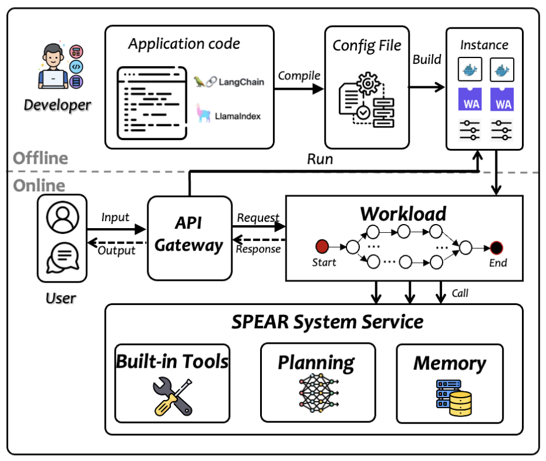

# SPEAR high-level design

## Design principles
SPEAR's first design principle is to help developers and end-users an easier approach to develop and deploy an AI Agent in Cloud-Edge integrated manner.

### Scalable
SPEAR aim to provide scalable agent service with the help of auto-scaling.

### Performant
SPEAR aim to serve Agent requests performant, with the help of prudently designed APIs and online scheduling system.

## Workflow

</img>

### Offline Phase
- Input: Code of existing agent framework (e.g., LangChain)
- Output: Deployment instance and configuration
- Key technology
  - Multi-instance selection
  - Automatic code generation

### Online Phase
- Input: Generated instance of offline phase
- Output: Scalable and performant user request serving
- Key technology
  - Cloud-edge-end integrated offloading
  - Agent-oriented auto-scaling